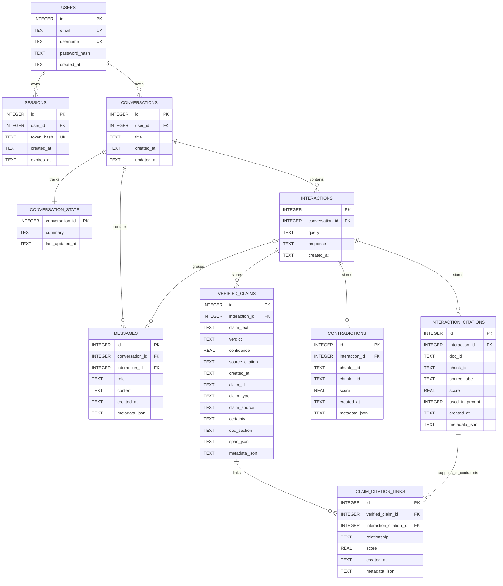
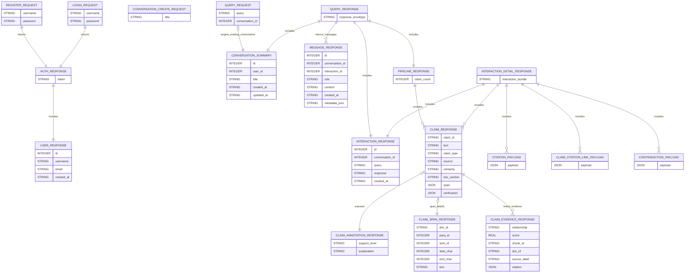

# Project Diagrams

These Mermaid diagrams are derived from the source in `src/storage/database.py`, `src/api/schemas.py`, `src/ingestion/document.py`, `src/api/uploads.py`, `src/indexing/index_builder.py`, `src/retrieval/user_uploads.py`, and `src/pipeline.py`.

## 1. Runtime Persistence ERD



## 2. API Contract ERD

Note: `citations`, `claim_citation_links`, and `contradictions` are open dict payloads reconstructed from stored metadata rather than strict Pydantic models.



## 3. Corpus, Upload, And Index Artifact ERD

This ERD models the file-backed schemas used for corpus preparation and user-upload overlays.

```mermaid
erDiagram
    LEGAL_DOCUMENT {
        STRING id PK
        STRING doc_type
        TEXT full_text
        STRING case_name
        STRING citation
        STRING court
        STRING court_level
        DATE date_decided
        INTEGER title
        STRING section
        STRING source_file
        BOOLEAN is_privileged
    }

    LEGAL_CHUNK {
        STRING id PK
        STRING doc_id FK
        TEXT text
        INTEGER chunk_index
        STRING doc_type
        STRING case_name
        STRING court
        STRING court_level
        STRING citation
        DATE date_decided
        INTEGER title
        STRING section
        STRING source_file
    }

    RAW_JSONL_ROW {
        STRING id PK
        STRING doc_type
        TEXT full_text
        STRING case_name
        STRING citation
        STRING court
        STRING court_level
        STRING date_decided
        STRING source_file
        BOOLEAN is_privileged
        STRING uploaded_at
    }

    PROCESSED_CHUNK_ROW {
        STRING id PK
        STRING doc_id FK
        TEXT text
        INTEGER chunk_index
        STRING doc_type
        STRING case_name
        STRING court
        STRING court_level
        STRING citation
        STRING date_decided
        INTEGER title
        STRING section
        STRING source_file
    }

    BM25_ARTIFACT {
        STRING bm25_path PK
        INTEGER chunk_count
        STRING serialization_format
    }

    CHROMA_COLLECTION {
        STRING chroma_path PK
        STRING collection_name
        STRING distance_metric
        INTEGER embedding_dim
    }

    INDEX_SUMMARY {
        STRING summary_path PK
        STRING processed_dir
        INTEGER chunk_count
        STRING embedding_model
        STRING built_at
    }

    USER_UPLOAD_BATCH {
        INTEGER user_id
        INTEGER conversation_id
        BOOLEAN is_privileged
        INTEGER files_uploaded
        INTEGER documents_upserted
        INTEGER chunks_upserted
    }

    UPLOAD_FILE_SUMMARY {
        STRING filename
        STRING content_type
        STRING document_id FK
        INTEGER size_bytes
        INTEGER chunk_count
        BOOLEAN is_privileged
    }

    LEGAL_DOCUMENT ||--|| RAW_JSONL_ROW : serialized_as
    LEGAL_DOCUMENT ||--o{ LEGAL_CHUNK : splits_into
    LEGAL_CHUNK ||--|| PROCESSED_CHUNK_ROW : serialized_as
    PROCESSED_CHUNK_ROW }o--|| BM25_ARTIFACT : indexed_into
    PROCESSED_CHUNK_ROW }o--|| CHROMA_COLLECTION : embedded_into
    BM25_ARTIFACT ||--|| INDEX_SUMMARY : described_by
    CHROMA_COLLECTION ||--|| INDEX_SUMMARY : described_by
    USER_UPLOAD_BATCH ||--o{ UPLOAD_FILE_SUMMARY : returns
    UPLOAD_FILE_SUMMARY }o--|| LEGAL_DOCUMENT : materializes
```



## 4. General Architecture

```mermaid
flowchart TB
    user[User]
    client[Streamlit Client<br/>src/client/ui.py]

    subgraph api[FastAPI Server]
        auth[Auth Routes<br/>/api/auth/*]
        conv[Conversation Routes<br/>/api/conversations/*]
        query[Query Route<br/>/api/query]
        uploads[Upload Route<br/>/api/uploads]
        deps[Shared Dependencies<br/>Database + QueryPipeline singletons]
        pipeline[QueryPipeline<br/>src/pipeline.py]
    end

    subgraph runtime[Runtime Services]
        sqlite[(SQLite<br/>data/legalverifirag.db)]
        ollama[Ollama HTTP API]
        verifier[Claim Decomposer + NLI Verifier]
        contract[Claim Contract Normalizer]
        hybrid[HybridRetriever]
        publicidx[Public Indexes<br/>BM25 + Chroma]
        useridx[User Upload Indexes<br/>per-user BM25 + Chroma]
    end

    subgraph uploads_data[User Upload Workspace]
        files[Stored Originals<br/>data/uploads/user_{id}/files]
        rawjsonl[Raw Upload JSONL<br/>data/uploads/user_{id}/raw]
        processedjsonl[Processed Chunk JSONL<br/>data/uploads/user_{id}/processed]
        uploadbuild[Index Builder<br/>build_user_upload_indices]
    end

    subgraph offline[Offline Corpus Build]
        courtlistener[CourtListener API]
        corpusbuilder[CorpusBuilder]
        rawcorpus[Raw Corpus JSONL<br/>data/raw]
        preparer[prepare_corpus]
        processedcorpus[Processed Chunk JSONL<br/>data/processed]
        indexbuilder[build_indices]
        indexsummary[Index Summary<br/>data/index/*]
    end

    user --> client
    client -->|HTTP| auth
    client -->|HTTP| conv
    client -->|HTTP| query
    client -->|multipart upload| uploads

    auth --> deps
    conv --> deps
    query --> deps
    uploads --> deps

    auth --> sqlite
    conv --> sqlite
    query --> pipeline
    pipeline --> sqlite
    pipeline --> hybrid
    pipeline --> ollama
    pipeline --> verifier
    verifier --> contract
    pipeline --> contract

    hybrid --> publicidx
    hybrid --> useridx

    uploads --> files
    uploads --> rawjsonl
    uploads --> processedjsonl
    uploads --> uploadbuild
    uploadbuild --> useridx

    courtlistener --> corpusbuilder
    corpusbuilder --> rawcorpus
    rawcorpus --> preparer
    preparer --> processedcorpus
    processedcorpus --> indexbuilder
    indexbuilder --> publicidx
    indexbuilder --> indexsummary
```
